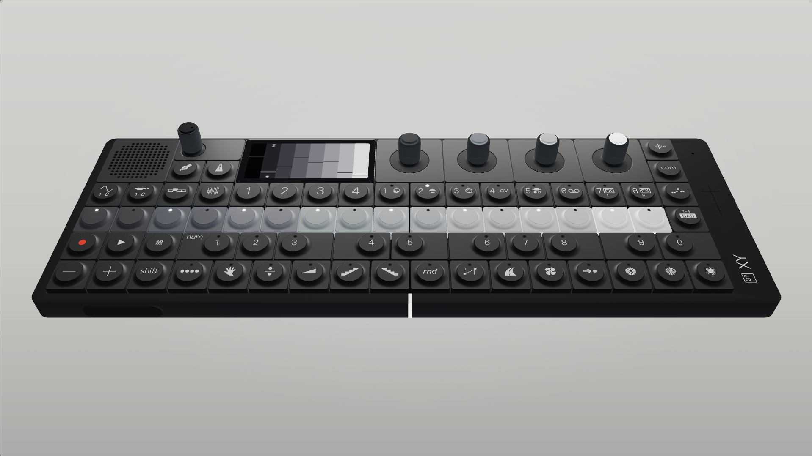
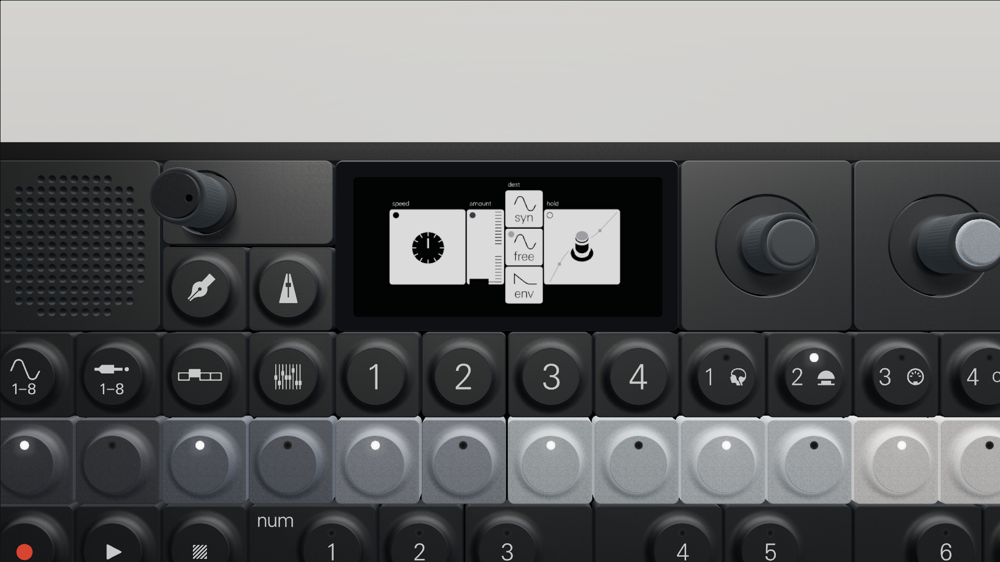

# Teenage Engineering OP-XY

A browser-based simulation of the Teenage Engineering OP-XY workstation with an interactive 3D device, responsive camera views, and animated screen UI.

**[Open the live site](https://mitchivin.github.io/te-opxy/)**

Works in a modern desktop or mobile browser. The device can be explored directly in 3D, with the screen and hardware controls responding as you interact with them.

## Features

- Interactive WebGL model of the Teenage Engineering OP-XY hardware
- Orbit, pan, and zoom camera controls
- Interactive keys, encoders, and screen controls
- Animated screen pages and device feedback
- Responsive landscape layout for desktop and mobile

## Get started

1. [Open the live site](https://mitchivin.github.io/te-opxy/).
2. Drag with the middle or right mouse button to orbit the camera.
3. Use Shift with the middle or right mouse button to pan, and the wheel to zoom.
4. Click and drag the hardware controls to interact with the device.

## About

Built by [Mitch Ivin](https://mitchivin.com/). This is an independent browser simulation inspired by the Teenage Engineering OP-XY hardware and is not affiliated with Teenage Engineering.

The application source is maintained privately; this repository is the public deployment surface for the live site.
