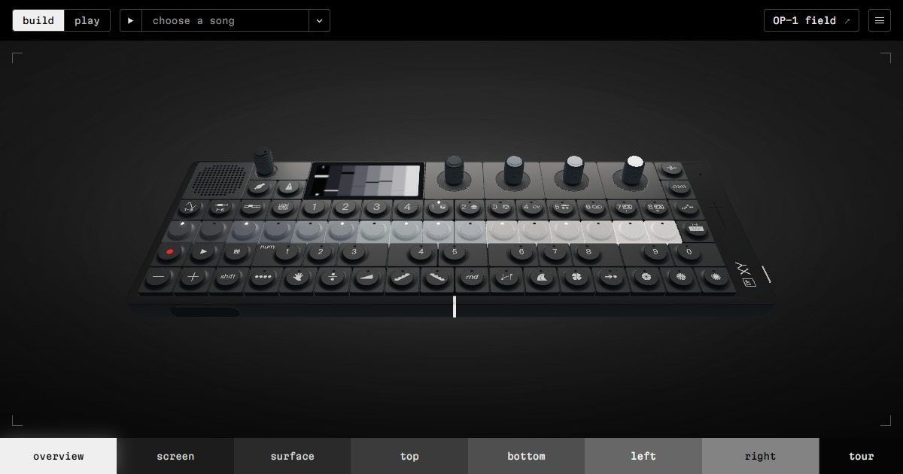
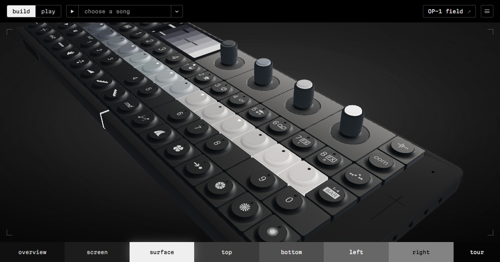

# OP-XY | Interactive Study

An interactive browser interpretation of the Teenage Engineering OP-XY. Explore the device, play its controls, and build or play featured tracks.

**[Open OP-XY](https://mitchivin.github.io/te-opxy/)** · **[Explore OP-1 Field](https://mitchivin.github.io/te-op1-field/)**

Works on desktop and phone. Choose **Build** to watch a track take shape through the device controls, **Play** to hear the arrangement, or play the keys and shape your own sounds.

- Playable keys, buttons and encoders with a responsive device display.
- Sequencer patterns, sound controls and a saved browser project.
- Featured tracks including Still D.R.E., Clint Eastwood, 19-2000 and Numb / Encore.
- Camera views for the screen, controls and hardware details.

This is a browser interpretation with simulated sound and workflows. It is not official firmware or a complete hardware emulator.

This repository contains the compiled website and public project information. The original application source is maintained privately alongside the OP-1 Field study.

## Related

- [OP-1 Field study](https://github.com/mitchivin/te-op1-field)
- [MiPod Classic](https://github.com/mitchivin/mipod)
- [Mi Boy Color](https://github.com/mitchivin/miboy)
- [Mitch Ivin](https://mitchivin.com/)

Built by [Mitch Ivin](https://mitchivin.com/). An independent creative project inspired by the Teenage Engineering OP-XY, with no affiliation to Teenage Engineering.
